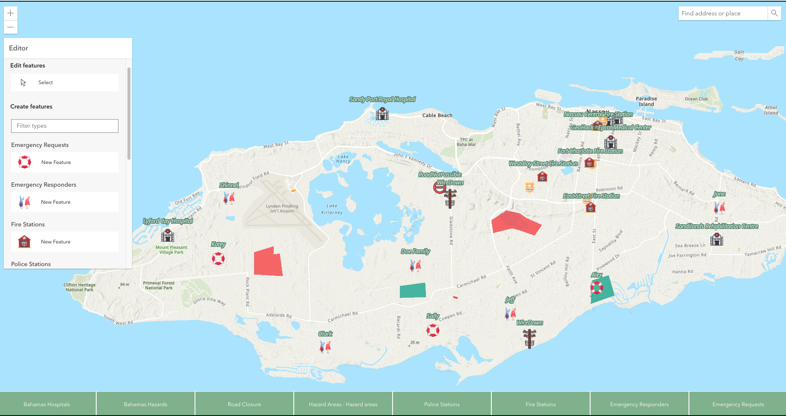

# App Name: Prudence

Originating from the word "prudent," which is associated with wise decision-making and careful management of resources. This sends a strong message to users that the app will help them make informed choices to ensure their safety during a disaster.

# App Summary and Goals

This disaster readiness web app has been developed to aid the island of Nassau in the Bahamas during hurricane events. The app focuses on addressing human and social impacts by providing crucial information and facilitating communication between emergency responders and citizens in need.

Key Features:

- Location Data on Map: Displays hospitals, police stations, fire stations, and hazard instances such as blocked roads, fallen wires, or flooding.
- Interactive Information: Clicking on map items reveals essential information about the selected infrastructure or service, such as available beds in hospitals or available firefighters and firetrucks at a fire station. A user can easily update or remove any information/event displayed to keep the source with the most recent, accurate data.
- Emergency Responder & Citizen Communication: The app allows users to offer or request assistance, connecting emergency responders with citizens in need.
- Route Planning: Provides directions between two selected points on the map.
- Search Function: Users can search for locations within Nassau using coordinates or natural language queries.

# Conclusion:

The disaster readiness web app for Nassau, Bahamas, serves as a valuable tool to help the community prepare for, respond to, and recover from hurricane events. By providing critical information and fostering communication between emergency responders and citizens, the app has the potential to save lives and mitigate the impacts of these natural disasters.

